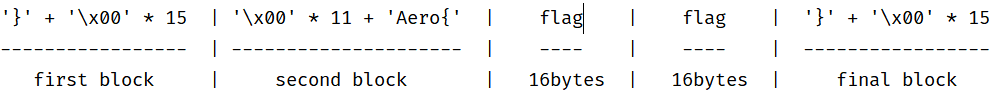
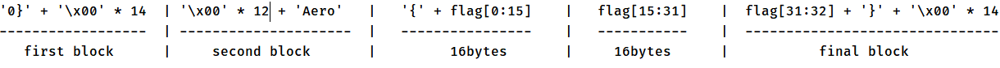

# Aero CTF 2020

## Old Crypto Server

>We found a very old crypto server.
>He has a secret that we want to get.
>However, he will not give it up so easily.
>
>Download (see main.py)
>
>nc tasks.aeroctf.com 44323
>
>flag form for this task is Aero{[0-9a-f]{32}} *
>
>@revker
	

From the source code, we can get the length of the flag is 38. And it starts with `Aero{` and ends with `}`. We also get the encryption method is AES-ECB.

The option 3 shows that it uses AES-ECB to encrypt `msg(our input) and server secret(flag)`. The `msg` is controllable, so we can leverage the property to get the flag.

In ECB, a block is 16 bytes. If we send `msg = '}' + '\x00' * 15` and calculate the size of block(`'\x00' * 11`) to the server, the first block will match the final block. See the figure for more details.

We can send `msg = '0' + '}' + '\x00' * 14 + '\x00' * 12`, `msg = '1' + '}' + '\x00' * 14 + '\x00' * 12`, ..., until it matches the final block. Keep going and we can get the whole flag.

You can see the details in `solve.py`.

